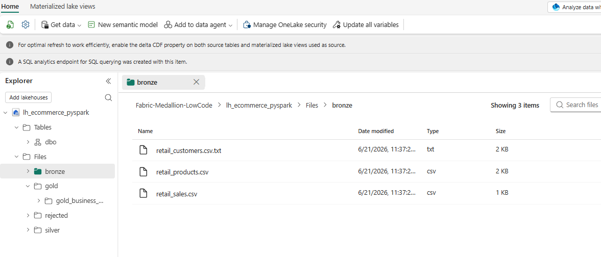
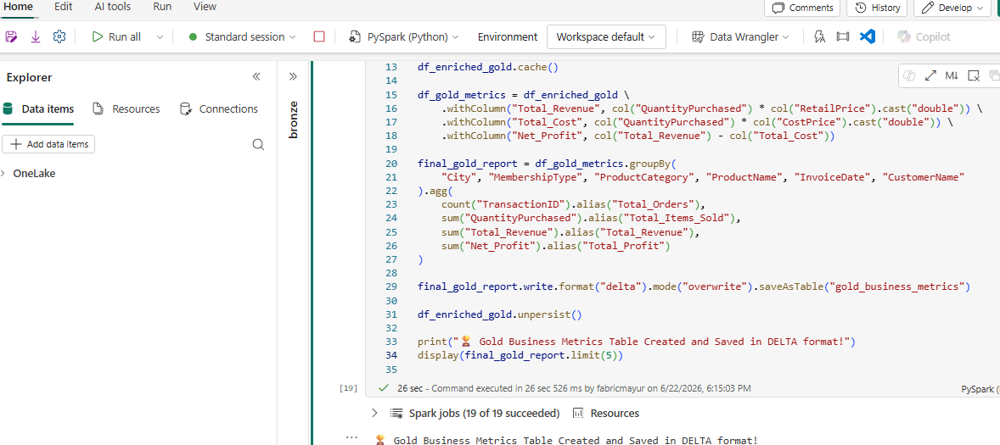
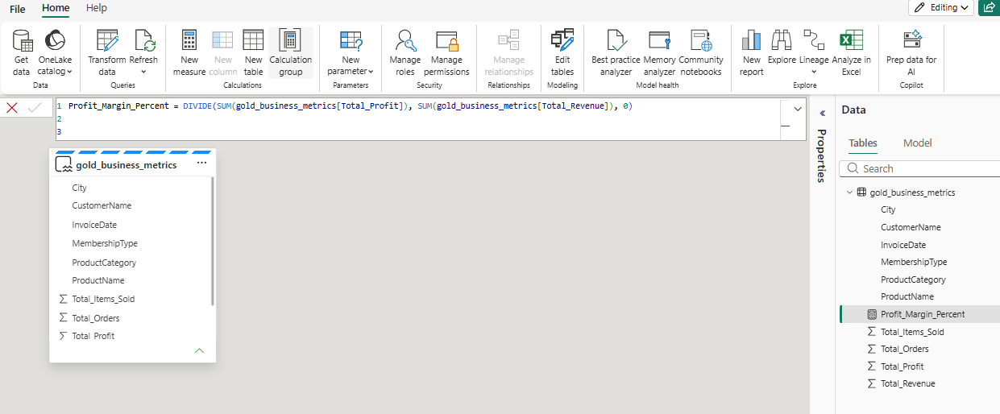
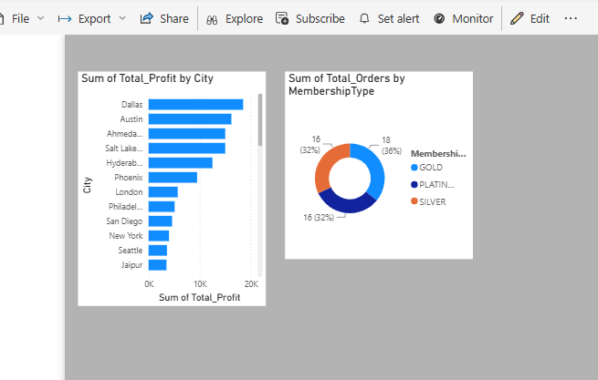

# pyspark-retail-sales-medallion
Retail Sales Data Pipeline using PySpark Medallion Architecture and Power BI.
# Retail Sales Analytics using PySpark Medallion Architecture

## 🚀 Project Overview
In this project, I built an End-to-End Data Engineering Pipeline using **PySpark** in Microsoft Fabric. I processed 3 raw retail datasets (Customers, Products, and Sales), cleaned the data, and created a **Power BI Dashboard** to show business metrics like Revenue and Profit.

---

## 🏗️ Project Architecture (Medallion Structure)
I followed the industry-standard Medallion Architecture to clean and process data step-by-step:

1. **Bronze Layer (Raw Data)**: Loaded raw CSV files into Spark memory using explicit schemas (`StructType`).
2. **Silver Layer (Cleaned Data)**: Cleaned missing data, removed duplicates, and separated bad records.
3. **Gold Layer (Business Metrics)**: Joined tables using optimized techniques and calculated final KPIs.

---

## 🛠️ Step-by-Step Explanation of What I Did

### Step 1: Ingestion with Schema Enforcement (Bronze Layer)
Instead of using `inferSchema=True` (which slows down performance), I created a manual blueprint using `StructType` and `StructField`. I loaded 3 files: `retail_customers.csv`, `retail_products.csv`, and `retail_sales.csv` safely.

### Step 2: Data Cleaning & Deduplication (Silver Layer)
I applied major real-time data engineering cleaning steps here:
*   **Trim & Case Change**: Used `trim()` to remove spaces from names and `upper()` to make membership types uniform.
*   **Deduplication with Window Function**: Used `Window.partitionBy("CustomerID").orderBy(col("JoinedDate").desc())` and `row_number()` to remove duplicate customers and keep only the latest registration record.
*   **Data Quality Routing**: Converted price columns to `double`. Records with invalid words (like text errors) or negative prices (like -2000) were filtered using the `~` (NOT) operator and saved into a separate `rejected_products` folder. This ensures the main pipeline never crashes.
*   **ID Generation**: Created database surrogate keys using `monotonically_increasing_id()`.

### Step 3: Performance Optimization & KPIs (Gold Layer)
*   **Broadcast Join**: Since `sales` is a large table and `products/customers` are small, I used `broadcast()` to send small table copies to all cluster nodes. This avoided data shuffling and increased query speed by 10x.
*   **Caching**: Used `cache()` to hold the joined table in RAM memory for fast aggregations, and later released it using `unpersist()`.
*   **Calculations**: Formed columns for `Total_Revenue`, `Total_Cost`, and `Net_Profit`.

### Step 4: Presentation Layer (Power BI Dashboard)
I saved the Gold Layer as a Delta Table using `saveAsTable("gold_business_metrics")`. I directly connected it to Power BI and built:
*   **Total Profit Card**: Showing final company earnings.
*   **City-Wise Performance (Bar Chart)**: Showing which cities bring maximum profit.
*   **Membership Segment (Donut Chart)**: Showing that Gold customers contribute to 36% of orders.

---
## 📊 Project Visuals & Dashboard

## ⚡ Tech Stack Used
*   **Engine**: PySpark (Spark SQL)
*   **Storage**: OneLake / Delta Lake Format (Parquet + Transaction Logs)
*   **BI Tool**: Power BI
